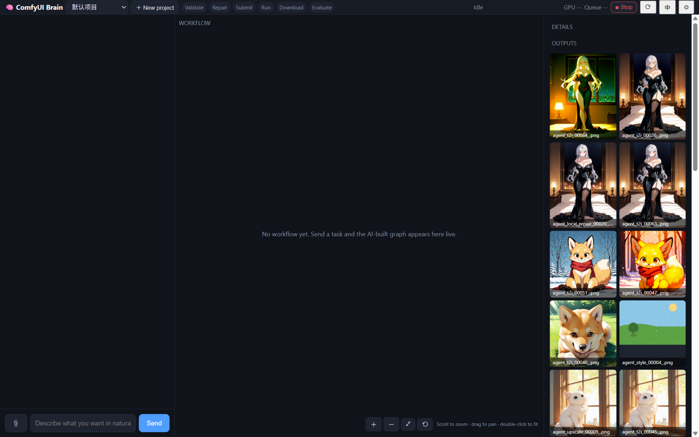

# comfy-agent — 聊天式驱动的本机 ComfyUI 执行引擎

**English** | [中文](README.zh-CN.md)

> Talk to your local ComfyUI. It picks the template, writes the prompts, validates, executes, **looks at the result with a VLM and repairs until it passes** — while your GPU stays guarded. BYOK: your keys never leave your machine.



- **The gap it fills**: the official in-app Comfy Agent helps you *build* workflows on the canvas; comfy-agent runs the loop *outside* the canvas — chat → template → validated execution → VLM evaluation → auto-repair → delivery. Complex, repeatable, local.
- **中文界面/文档开箱即用**（右上角 `EN/中` 一键切换）。
- Pure Python standard library. **Zero pip dependencies.** MIT.

## Highlights

- **Execution-repair loop**: local pre-validation against your machine's node signatures (1500+) → structured server errors → parameter repair (≤3 rounds) → VLM region-level evaluation → semantic repair. Failed evaluations never claim success.
- **Local repair that really is local**: "fix the hand / face" routes to a mask pipeline — pixels outside the mask stay **bit-identical** (verified). If no region is detected it says so instead of pretending.
- **Missing model? It finds it**: searches HuggingFace (+mirror) / Civitai / ModelScope / local Manager cache, shows a confirm dialog (file / size / source / fit / target dir), downloads with progress, then **re-runs the failed task automatically**.
- **BYOK, any OpenAI-compatible API**: z.ai / DeepSeek / Kimi / OpenAI / Volcano Ark / local **Ollama**. Vision follows the brain's settings by default, with a one-click **vision self-check**.
- **GPU safety**: temperature fuse (default 88 °C, interrupt-first), VRAM gauge, OOM → auto lower resolution/batch and retry once.
- **Projects & skill memory**: tasks are isolated per project; successful trajectories are remembered and recalled for similar tasks.
- **UI**: streaming thinking, live workflow graph (click a node to inspect), stage pipeline, tool cards, gallery, i18n (EN/中文).

## Quickstart — zero API key (free tier or local LLM)

1. Have ComfyUI running on `127.0.0.1:8188` (any install).
2. Get a brain, free:
   - **Free API (includes vision)**: a Zhipu API key — GLM-4.7-Flash (brain) and GLM-4.6V-Flash (vision) are free tiers on [bigmodel.cn](https://open.bigmodel.cn) / [z.ai](https://z.ai). Enter them in the ⚙ panel: base `https://open.bigmodel.cn/api/paas/v4`, brain model `glm-4.7-flash`, vision model `glm-4.6v-flash`.
   - **Fully local**: [Ollama](https://ollama.com) — pull any instruct model (e.g. `qwen3`), then ⚙ base `http://127.0.0.1:11434/v1`. For image understanding pull a vision model (e.g. `qwen2.5vl`) and set it as the vision model.
3. Launch:
   - **Windows**: double-click `scripts\install.bat` (asked once for your ComfyUI path) → double-click `scripts\一键启动.bat` → browser opens `http://127.0.0.1:8899`.
   - **macOS / Linux**: `./scripts/install.sh` → `./scripts/start.sh` (same ports).
4. Type what you want: *"a cyberpunk orange cat wearing an astronaut helmet, 1024×1024, 4 images"*.

> ComfyUI root resolution (works for CLI/MCP runs too, not just the launcher scripts): `COMFY_ROOT` env → `comfy_root.local` in the project root → common-install probing.

## Quickstart — BYOK

⚙ panel → API base URL + key + model. Works with any OpenAI-compatible service. Keys are stored only in local `.comfy-agent/settings.json` (gitignored; masked in the UI).

## Install as a ComfyUI custom node

```bash
cd <your ComfyUI>/custom_nodes
git clone https://github.com/momang85/comfy-agent     # restart ComfyUI
```

Then add the **ComfyAgent Bridge** node anywhere and run it once — it starts the chat UI and prints the URL. ([Registry publishing steps](docs/custom-node-registry.md))

## Use from Claude Desktop / Cursor / Claude Code (MCP)

comfy-agent ships a zero-dependency stdio **MCP server** (`scripts/mcp_server.py`): your MCP client's LLM becomes the brain, and the engine exposes `comfy_status / comfy_inspect / comfy_list_templates / comfy_run_template / comfy_run_workflow / comfy_upload_image / comfy_models` — the full validate → repair → execute loop as tools.

```json
{ "mcpServers": { "comfy-agent": {
    "command": "python",
    "args": ["<repo>/scripts/mcp_server.py"] } } }
```

Details and per-client setup: [docs/mcp-server.md](docs/mcp-server.md)

## What a turn looks like

```
you (chat, optionally +image)
  ↓
brain/  agent loop: understand → pick template → write prompts → call tools → observe
  ↓ in-process
comfy_agent/  engine: render template → local validation → auto-repair → submit → download
  ↓ HTTP (loopback only)
ComfyUI 127.0.0.1:8188
  ↓
VLM evaluation (region-level) → repair / iterate → deliver summary + files
```

## Templates (auto-adapt to your checkpoints)

| ID | What | Model |
|---|---|---|
| t2i | text→image (+hires two-stage) | any SDXL / SD1.5 checkpoint (auto-bound) |
| i2i | image→image | any SDXL (auto-bound) |
| style_transfer | style transfer | SDXL + ControlNet |
| upscale_pass | tiled upscale | any SDXL |
| inpaint / local_repair | mask-only repaint (hand/face auto-detect, user mask, box) | base image + face/hand seg weights (auto-download offered) |
| minimax_t2v / i2v, ltx_i2v | video | those models by name (download dialog provided) |
| merge_videos / extract_frame | video utils | VHS |

## Engine without the brain (CLI)

```bash
python -m comfy_agent.cli status        # server status
python -m comfy_agent.cli templates     # template catalog
python -m comfy_agent.cli run t2i --json '{"prompt":"1cat, astronaut helmet","width":1024,"height":1024}'
python -m comfy_agent.cli health        # per-template wiring audit
```

## Docs

- 中文完整文档：[README.zh-CN.md](README.zh-CN.md)
- Architecture reflection & mechanisms: [docs/architecture-reflection-2026-09-13.md](docs/architecture-reflection-2026-09-13.md)
- Local repair design: [docs/local-repair-auto-route-2026-09-13.md](docs/local-repair-auto-route-2026-09-13.md)
- Market & adoption analysis: [docs/market-delta-and-adoption-2026-09-27.md](docs/market-delta-and-adoption-2026-09-27.md)
- Custom node / Registry publishing: [docs/custom-node-registry.md](docs/custom-node-registry.md)

## Privacy & security

- Chats, skills, outputs stay in local `.comfy-agent/`; API keys only in local `settings.json` (masked in UI, never committed).
- ComfyUI connection is loopback-only by default (SSRF guard; `COMFY_ALLOW_LAN=1` to opt out). LLM endpoints require https except loopback local runtimes (Ollama). Model downloads go to public http(s) hosts only, path-checked inside `models/`, size-capped.
- Engine code fingerprinting: if you edit code without restarting, the UI shows a red "please restart" banner and **refuses to run generation** instead of silently using stale logic.

## Status

296 unit tests green · used daily on a 12 GB Windows card (image + 5 s video) · v0.3.

## License

MIT
