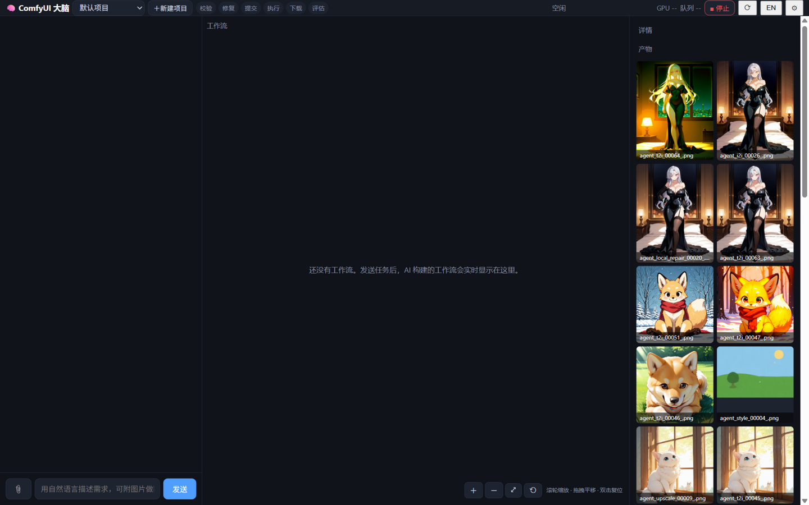

# comfy-agent — 聊天式驱动的本机 ComfyUI 执行引擎

[English](README.md) | **中文**

> 用自然语言（中文/English）跟本机 ComfyUI 干活：大脑自动选模板、写提示词、校验、执行，**用视觉模型看结果、不达标自动修到达标**——全程 GPU 带护栏，Key 只留本机。



- **定位**：官方 Comfy Agent 负责画布内"搭工作流"；comfy-agent 负责画布外"**跑、修、交付**"——聊天 → 模板 → 校验执行 → VLM 评估 → 自动修复 → 交付。复杂、可控、可复现的活。
- 界面右上角 `EN/中` 一键切换；纯 Python 标准库，**零第三方依赖**，MIT。

## 核心能力

- **执行-修复闭环**：本地预校验（对照本机 1500+ 节点签名）→ 服务器结构化报错解析 → 参数级修复（≤3 轮）→ VLM 区域级评估 → 语义级修复。评估不通过绝不假装成功。
- **局部修复真的只修局部**：说「修手/修脸」自动走遮罩链路——**遮罩区外像素逐位不变**（实测验证）；定位不到区域会如实说，不拿整图重绘凑数。
- **缺模型自己找**：搜 HuggingFace（含镜像）/ Civitai / ModelScope / 本机 Manager 缓存，弹窗确认（文件/大小/来源/适配/存放目录），带进度条下载，完成后**自动重跑刚才失败的任务**。
- **BYOK 任意 OpenAI 兼容服务**：智谱 / DeepSeek / Kimi / OpenAI / 火山方舟 / 本机 **Ollama**；视觉默认跟随大脑配置，带一键**视觉自检**。
- **GPU 护栏**：温度熔断（默认 88°C 先中断）、显存仪表、OOM 自动降分辨率/批数重试一次。
- **项目隔离 + 技能记忆**：任务按项目完全隔离；成功轨迹沉淀，同类任务下次直接走对的路。

## 快速开始——零 Key（免费档或本地 LLM）

1. 本机有 ComfyUI 在 `127.0.0.1:8188` 跑着（任意安装方式）。
2. 给大脑找个不要钱的：
   - **免费 API（连看图都免费）**：注册智谱拿 Key——GLM-4.7-Flash（大脑）与 GLM-4.6V-Flash（视觉）都是免费档（[bigmodel.cn](https://open.bigmodel.cn) / [z.ai](https://z.ai)）。⚙ 里填：地址 `https://open.bigmodel.cn/api/paas/v4`、大脑模型 `glm-4.7-flash`、视觉模型 `glm-4.6v-flash`。
   - **完全本地**：[Ollama](https://ollama.com) 拉一个指令模型（如 `qwen3`），⚙ 地址填 `http://127.0.0.1:11434/v1`；要看图就再拉一个视觉模型（如 `qwen2.5vl`）填进视觉模型。
3. 启动：
   - **Windows**：双击 `scripts\install.bat`（填一次 ComfyUI 路径）→ 双击 `scripts\一键启动.bat` → 浏览器打开 `http://127.0.0.1:8899`。
   - **macOS / Linux**：`./scripts/install.sh` → `./scripts/start.sh`（端口相同）。
4. 直接说人话：「画一只戴宇航头盔的赛博朋克橘猫，1024x1024，4 张」。

## 快速开始——BYOK

⚙ 面板 → API 地址 + Key + 模型名，保存即生效。Key 只存本机 `.comfy-agent/settings.json`（gitignored，界面只显示脱敏尾号）。

## 作为 ComfyUI custom node 安装

```bash
cd <你的ComfyUI>/custom_nodes
git clone https://github.com/momang85/comfy-agent     # 重启 ComfyUI
```

画布加 **ComfyAgent Bridge** 节点跑一次：自动拉起聊天 UI 并输出地址（Agent 以独立进程运行，崩溃不拖垮 ComfyUI）。Registry 发布步骤见 [docs/custom-node-registry.md](docs/custom-node-registry.md)。

## 一轮任务长什么样

```
你（中文自然语言，可带图片）
   ↓
brain/  大脑：理解需求 → 选模板 → 写提示词 → 调工具 → 看结果 → 迭代
   ↓ 进程内调用
comfy_agent/  引擎：模板渲染 → 本地校验 → 自动修复 → 提交执行 → 下载产物
   ↓ HTTP（仅限本机回环）
ComfyUI (127.0.0.1:8188)
   ↓
VLM 区域级评估 → 修复/迭代 → 中文总结 + 文件交付
```

## 模板库（图像模板自动适配本机 checkpoint）

| ID | 名称 | 模型 |
|---|---|---|
| t2i | 文生图（支持 hires 二段放大） | 任意 SDXL/SD1.5（自动绑定本机同家族） |
| i2i | 图生图 | 任意 SDXL（自动绑定） |
| style_transfer | 风格转绘 | SDXL + ControlNet |
| upscale_pass | 高清放大 | 任意 SDXL + tiled VAE |
| inpaint / local_repair | 局部重绘/局部修复（手/脸自动检测、用户遮罩、矩形框） | 原图 + 分割权重（缺失时弹窗下载） |
| minimax_t2v / minimax_i2v / ltx_i2v | 视频生成 | 对应模型按名安装（缺了有下载弹窗） |
| merge_videos / extract_frame | 视频拼接/取帧 | VHS |

## 引擎单独用（无需 LLM）

```bash
python -m comfy_agent.cli status            # 服务器状态
python -m comfy_agent.cli templates         # 模板目录
python -m comfy_agent.cli run t2i --json '{"prompt":"1cat, astronaut helmet","width":1024,"height":1024}'
python -m comfy_agent.cli health            # 全模板连线健康审计
```

## 文档索引

- English overview: [README.md](README.md)
- 架构反思与机制：[docs/architecture-reflection-2026-09-13.md](docs/architecture-reflection-2026-09-13.md)
- 局部修复设计：[docs/local-repair-auto-route-2026-09-13.md](docs/local-repair-auto-route-2026-09-13.md)
- 缺模型下载设计：[docs/missing-model-download-2026-09-12.md](docs/missing-model-download-2026-09-12.md)
- 视觉通道与上传绑定：[docs/vision-channel-and-upload-binding-2026-09-12.md](docs/vision-channel-and-upload-binding-2026-09-12.md)
- 市场与采用策略：[docs/market-delta-and-adoption-2026-09-27.md](docs/market-delta-and-adoption-2026-09-27.md)
- 新手走查报告：[docs/ux-walkthrough-novice-2026-09-13.md](docs/ux-walkthrough-novice-2026-09-13.md)
- Custom node / Registry 发布：[docs/custom-node-registry.md](docs/custom-node-registry.md)

## 常见问题

- **我的模型名和模板默认名不一样会失败吗？** 图像模板不会——运行期自动绑定本机同家族 checkpoint；偏好可在 `.comfy-agent/settings.json` 的 `model_prefs` 指定。
- **换了 API 之后看图不工作？** 视觉默认跟随大脑，但视觉模型名通常不同，⚙ 里必须单独填；面板会显示生效值与自检结论（✅/❌/⚠）。
- **显存小 / 没有独显？** 低显存或 CPU 模式都能跑通全流程（慢）；执行期 OOM 自动降参重试一次。视频大模型建议动态显存（默认），`COMFY_VRAM_MODE=high` 才是常驻显存（仅图像场景更快）。
- **能连别的机器上的 ComfyUI 吗？** 默认仅回环（SSRF 防护）；确有需要 `COMFY_ALLOW_LAN=1` 并改 `COMFY_URL`。
- **改了代码没重启就跑？** 引擎按模块指纹自检：发现磁盘代码比运行中的新，红色横幅提示重启并**拒绝执行生成类工具**——不会拿旧逻辑白烧 GPU。
- **Key 安全吗？** 只存本机 settings.json，只发给你自己配置的 LLM 地址；对话/记忆/产物全在本机。

## 安全与隐私

- ComfyUI 连接默认仅限回环；LLM 外部服务强制 https（本地 Ollama 仅回环 http）；阻断云元数据地址。
- 模型下载只走公网 http/https、逐段校验落盘路径限制在 `models/` 内、单文件上限 40GB（`MODEL_DOWNLOAD_MAX_GB` 可调）。
- 对话记录、技能记忆、产物全部在本机 `.comfy-agent/`（gitignored）。
- CLI 文件读取限制在允许目录，禁止 `..` 穿越；自动修复永不静默（全部记录在 repairs 报告）。

## 现状

296 项单测全绿 · 12GB 显存 Windows 卡日常使用（图像 + 5 秒视频）· v0.3 · MIT。
